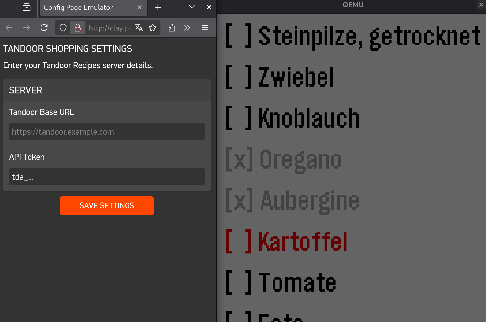

# tandoor-list

> *Check your tandoor recipes shopping list on the go 📝*

This app connects to a [Tandoor](https://tandoor.dev/) instance, loads the current shopping list, and lets you mark items as checked directly from your Pebble watch.

<details><summary>Screenshot</summary>



</details>

## Building & running

```sh
make install    # build and install in the local emulator
make cloud      # build and install on a watch using the pebble app dev-connection
make config     # configure the emulator app instance
make debug      # run a debug build in the local emulator
```
